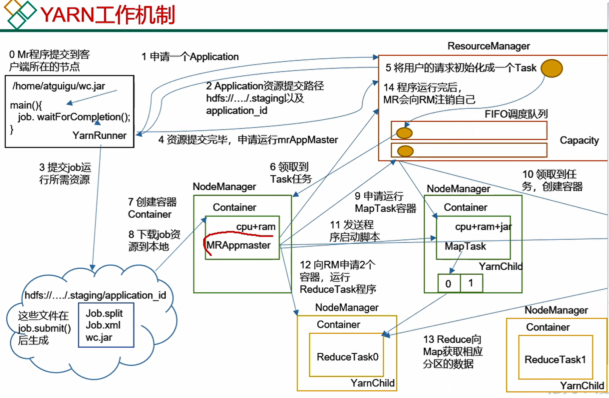
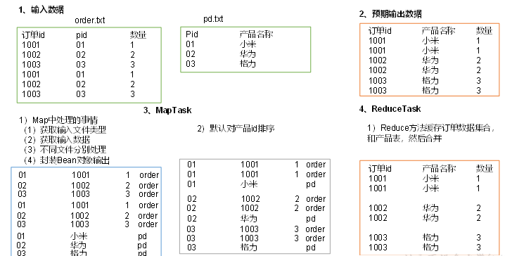
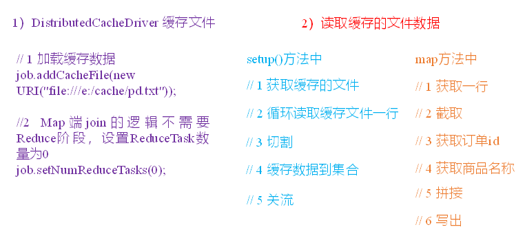

## Maven

类似于anaconda，项目管理，方便编译、依赖、测试、部署


## hadoop

```shell
hadoop fs -put filename /dir
put/copyFromLocal/appendToFile/get/copyToLocal/getmerge
```

- hdfs：文件存储管理
  - NameNode：全局的存放数据块对应索引
  - DataNode： 节点存放数据
  - SecondaryNameNode： 非热备，用于备份namenode（namenode平时只存储行为日志，因此重启时读取日志恢复耗时，需要按时备份）
- yarn：任务、资源管理。resource manager首先分配nodemanager来运行container，在container里运行app master，app master会进一步申请资源，在其他节点新分配的container中运行map或reduce任务，运行完归还资源。
  - ResourceManager：统筹全局
  - NodeManager：管理当前节点的资源
  - client：用户通过客户端提交任务
  - container：资源以容器划分给任务
  - app master：
- mapreduce：应用程序开发框架


**hadoop策略**：先map，hash分区（后续给各个reduce），排序，再分组（根据key进行分组），reduce。

1. 需要按照key1分组后，以key2排序。在hadoop中应该以key1，key2进行排序，然后就是key1,key2的联合分组，进行处理。




**Reduce Join**



**map join**

没有reduce过程，所有的工作都在map阶段完成，极大减少了网络传输和io的代价。如何实现：

**上述的join过程可以看作外表与内表的连接过程，外表是订单表，外表大，内表是商品表，内表小。**所以可以把内表事先缓存于各个maptask结点，然后等到外表的数据传输过来以后，直接用外表的数据连接内表的数据并输出即可




### zookeeper

进行存储和管理数据，一旦数据的状态发生变化，通知注册的观察者做出反应。由1个leader和多个follower组成的集群。比如某一server节点挂了，就通知client。

### HA

high availability：多个NN，以防止NN挂掉。

### Hive

**开启hive**

分发修改后的文件到其他集群服务器上：

```shell
my-start-all.sh
systemctl start mysqld
$HIVE_HOME/bin/hiveservices.sh start

# 连接hive
beeline -u jdbc:hive2://c1:10000 -n root
```


