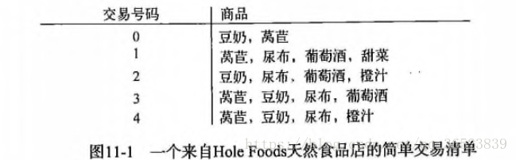

# Apriori

支持度：某一项在数据集中出现的概率。例如豆奶是4/5，（豆奶、尿布）为3/5

可信度：对于{尿布}->{葡萄酒} = 支持度{尿布，葡萄酒}/支持度{尿布} ，其中{尿布，葡萄酒}的支持度为3/5，{尿布}的支持度为4/5，所以“尿布->葡萄酒”的可行度为3/4=0.75，这意味着尿布的记录中，我们的规则有75%都适用。

频繁项集：满足最小支持度要求的项集。如果1号商品不频繁出现，那么12号组合一定也不频繁出现。由此节省计算量。

