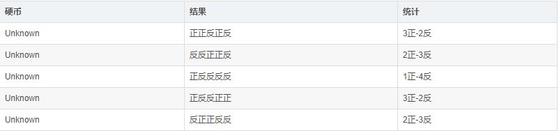
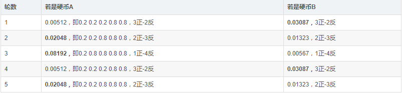
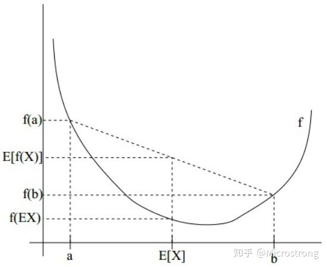

# EM 最大期望算法

**Expectation-maximization algorithm**

在概率模型中寻找参数最大似然估计或者最大后验估计的算法，其中概率模型依赖于无法观测的隐性变量。

**第一步**是计算期望（E），利用对隐藏变量的现有估计值，计算其最大似然估计值；

**第二步**是最大化（M），最大化在E步上求得的最大似然值来计算参数的值。M步上找到的参数估计值被用于下一个E步计算中，这个过程不断交替进行。

## 简单原理

有两个不同的硬币AB，他们分别正面朝上的概率为$P_A$,$P_B$，未知。现在需要分类硬币是A还是B，如下图。

先假设$P_A=0.2, P_B=0.7$，那么

按照最大似然估计，重新计算的$P_A=(2+1+2)/15=0.33$, $P_B=(3+3)/10=0.6$

如此不断循环迭代。

## jensen不等式

对于凸函数，满足：
$$
E[f(X)] \geq f(E[X])
$$

## 公式描述

假设目标函数：$j$为类别$j$，$z$为隐变量
$$
L(\theta) = \prod_{j=1}^N P_\theta(y_i) \\

代入全概率公式（有隐变量） P(B)= \sum_{i=1}^n P(A_i)P(B|A_i) \\

L(\theta) = \prod_{j=1}^N \sum^{|z|} P_{\theta}(z)P_\theta (y_i|z) \\

取对数 \ln L(\theta) = \sum_{j=1}^N \ln \sum^{|z|} P_{\theta}(z)P_\theta (y_i|z) \\
$$
开始EM算法迭代求解
$$
对于 \ln \sum^{|z|}P_\theta(z)P_\theta(y_i|z) = \ln \sum^{|z|} P_{\theta_n}(z|y_j) \frac{ P_\theta(z)P_\theta(y_i|z)}{P_{\theta_n}(z|y_j)} \\

代入jensen，原式 \geq \sum^{|z|} P_{\theta_n}(z|y_j) \ln \frac{ P_\theta(z)P_\theta(y_i|z)}{P_{\theta_n}(z|y_j)} \\
$$
那么,每一步我们都希望最大化$l(\theta)$，（因为最大化用求导的方式，省略常数项）即最大化下式，其中$\theta_n$是上一步的结果，也是常数
$$
l(\theta) = l(\theta_n) + (l(\theta)-l(\theta_n)) \\

代入，使用jensen, l(\theta) \geq 常数+\sum_{j=1}^N[ \sum^{|z|} P_{\theta_n}(y_j)\ln \frac{P_\theta(y_j|z)P_\theta(z)}{P_{\theta_n}(z|y_j)} - \ln P_{\theta_n}(y_j)] \\

l(\theta) \geq 常数+\sum_{j=1}^N[\sum^{|z|} P_{\theta_n}(y_j)\ln \frac{P_\theta(y_j|z)P_\theta(z)}{P_{\theta_n}(z|y_j)} - \sum^{|z|} P_{\theta_n}(z|y_j) \ln P_{\theta_n}(y_j)] \\

l(\theta) \geq 常数+\sum_{j=1}^N \sum^{|z|} P_{\theta_n}(y_j) [\ln \frac{P_\theta(y_j|z)P_\theta(z)}{P_{\theta_n}(z|y_j)P_{\theta_n}(y_j)}] \\

l(\theta) \geq 常数+\sum_{j=1}^N \sum^{|z|} P_{\theta_n}(y_j) [\ln \frac{P_\theta(y_j,z)}{P_{\theta_n}(z,y_j)}] \\
$$
即，去除常数项后，对下式求偏导=0
$$
Q(\theta|\theta_n) = \sum_{j=1}^N \sum^{|z|} P_{\theta_n}\sum^{|z|} P_{\theta_n}(z|y_j) \ln P_{\theta}(y_j,z)
$$
(是算法不是model)

