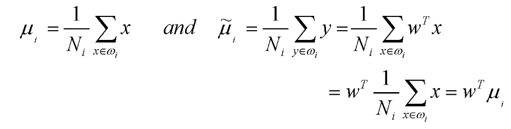
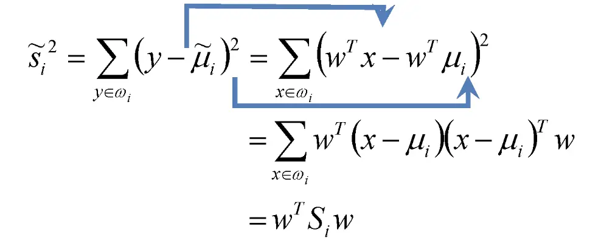
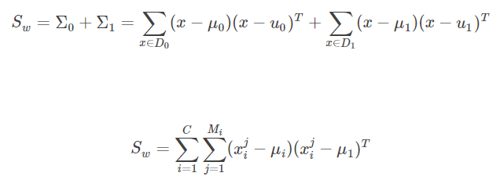
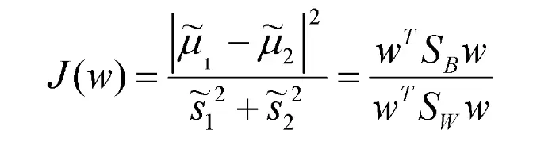
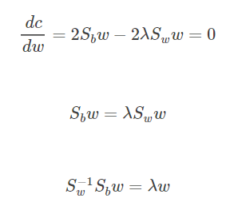
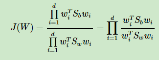

LDA: 有监督的降维，投影后类内方差最小，类间方差最大。选择分类性能最好的投影方向（PCA选最大方差的方向）

均值

方差

目标函数

求导这一步，重写成约束的方式，再拉格朗日乘子，方便计算：

然后获取特征值特征向量W，X dot W转换。

**多类别**怎么做？目标函数替换为d个连乘（d为降维后维度）。广义瑞利商

为什么不能投影到大于**k-1**维的子空间？因为$S_b$只有K类，K个一维向量得到的矩阵，秩为k-1 （onehot类似,最后一条可以由前k-1条推出）

如何用于**分类**？假设高斯分布，已知每个类别的均值方差，然后计算新样本属于哪一块。