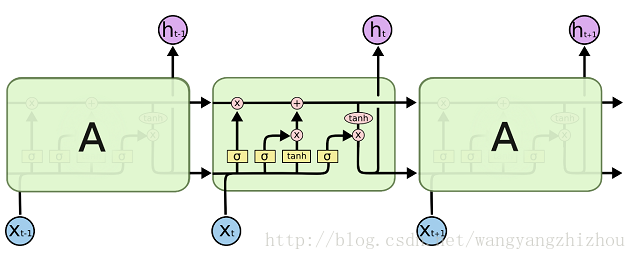
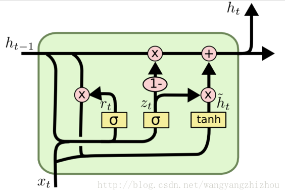

1. 长时记忆：关于当前输入和上一轮的结果  得出  上一次长时记忆保留多少
2. 长时记忆增加内容：X和上次的短时记忆百分比地加入到长时记忆
3. 短时记忆：长时记忆 和  短时+X  综合决定输出结果（上一轮的结果）

**由短时和X 决定 输出多少更新后的长时记忆**

## GRU

1. 根据上次输出和x，决定上次输出保留多少百分比，这次计算结果占多少百分比
2. 这次计算结果 主要由   上次保留一定程度  和  X 来决定的

**由X和记忆决定 新的记忆有多少百分比$X*sigmoid(W[h_{t-1},X_t])$和tanhX**

