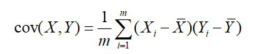
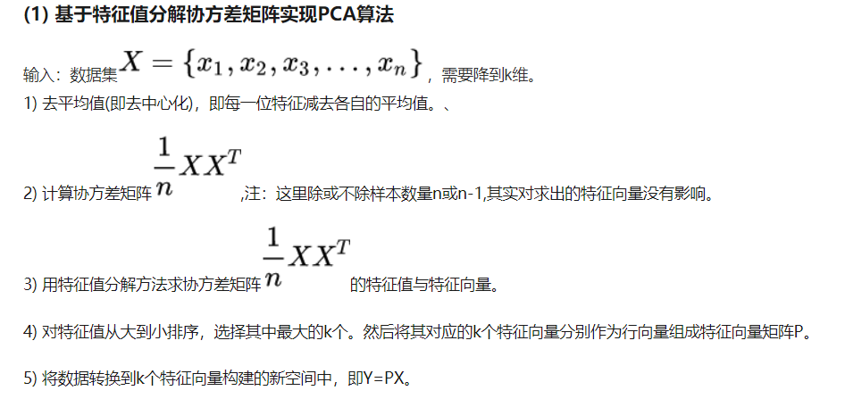
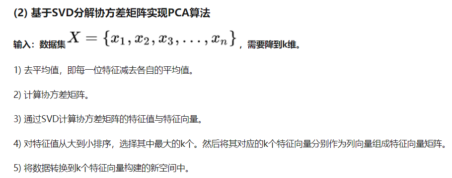
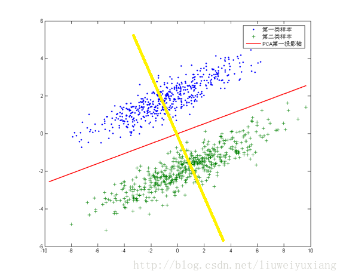

PCA需要归一化，因为衡量协方差矩阵，假设是量纲一致的

性质：实对称阵的特征向量必定正交。

协方差代表相关性，协方差为0代表不相关

特征向量代表方向，即映射到某一超平面。特征值代表放缩的大小。

最后选择的特征向量堆叠为矩阵B，B · X 即为降维。（为什么？正交看作新基上的坐标，然后将X投影上B），因此PCA投影到主要正交方向，反例：

保留信息百分比，由保留的特征值百分比决定。

