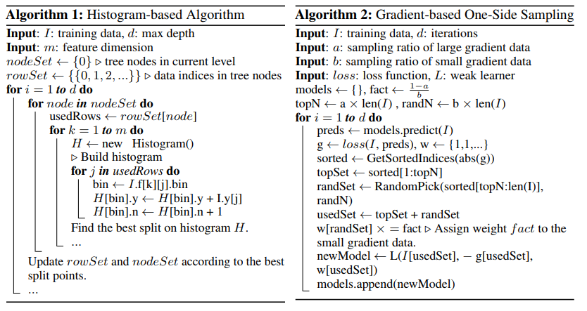
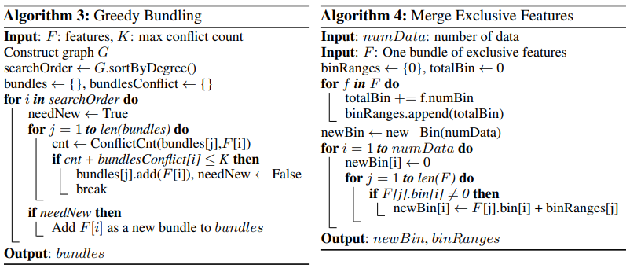

# 应用

## 常见问题

- 拟合的“残差”是什么：
  
- 分裂时，只考虑上一轮y的一阶二阶导的gain增益。
  
  - 预测时，某叶子的权重和为$w_j^* = - \frac{G_j}{H_j + \lambda}$，因此拟合的是权重和求平均，即跟这个叶子的整体一二阶导有关。
  
- gamma是什么用的？/ 是先剪枝还是后剪枝？

  采用先剪枝，在分割的时候衡量提升的Gain，来进行先剪枝。

  $$
  Gain = \frac{1}{2} [\frac{G_L^2}{H_L+\lambda} + \frac{G_R^2}{H_R+\lambda} - \frac{(G_L+G_R)^2}{H_L+H_R+\lambda}] - \gamma
  $$

- 类别特征如何处理？

  原文中采用的是one-hot
  
- XGB是leaf-wise还是layer-wise的？

  采用layer-wise，所以某些情况精度上会有影响。

- 什么时候pre-stopping？

  如果没有>0的split gain，就停止。

- 缺失值如何处理？

  看作稀疏矩阵处理，寻找split点时直接忽略，然后真正split时会计算将该种特征缺失时放在左子树或右子树的不同gain，然后选择增益大的方向。如果训练中该特征值未出现缺失而测试中出现，会划分到右子树。

- 收缩因子是什么？

  每棵树学习完之后，会把这棵树加入模型。加入时，树的每个叶子权重乘上收缩因子（超参，类似学习率），防止树一次学完，减少过拟合。

- 对某一棵树寻找split点的时候，有哪些方法？

  - 精确的先排序，再二分计算损失增益找到最优。
  - 在整棵树上对特征的百分位数进行切分（近似）。
  - 在该叶子上对特征的百分位数进行切分（近似）。

## 优点

- 二阶泰勒对目标函数近似，相比其他GBM精度更高。
- 分布式或大数据量时，采用局部近似算法找分裂点，选取适当的eps可以保持算法性能并加速
- 使用l1，l2范数进行先剪枝
- 可以并行，主要在求不同候选分裂点的Gain上
- 可以处理类别特征和缺失值
- 通过收缩因子模拟学习率，防止过拟合。

## 缺点

- pre-sorted需要内存空间
- 数据分割时对每一个叶子的每一个特征都要遍历
- layer-wise，比如某一节点分裂收益很大，但是高度限制导致无法再分裂。而相对已经很优的节点又必须分裂，就导致了过拟合

# 推导

目标函数可以分为`training loss`和`regularization term`：
$$
\begin{eqnarray}
obj(\theta) & = & L(\theta) + \Omega(\theta) \\
& = & \sum_i^n l(y_i,\hat{y_i}) + \sum_{k=1}^K \Omega (f_k)
\end{eqnarray}
$$
其中$l(y_i,\hat{y_i})$为`loss function`，n为样本数，K为树的个数。

## 损失函数

对于第 t 棵树的预测值，用$\hat{y_i}^{(t)}$表示，那么根据GBTree的定义，第 t 棵树为了拟合第 t-1 棵树的残差：
$$
\begin{eqnarray}
\hat{y_i}^{(0)} &=& 0 \\
\hat{y_i}^{(1)} &=& f_1(x_i) = \hat{y_i}^{(0)} + f_1(x_i) \\
\hat{y_i}^{(2)} &=& f_1(x_i) + f_2(x_i) = \hat{y_i}^{(1)} + f_2(x_i) \\
... \\
\hat{y_i}^{(t)} &=& \sum_{k=1}^t f_k(x_i) = \hat{y_i}^{(t-1)} + f_t(x_i)
\end{eqnarray}
$$
因此目标函数可以表示为残差的形式，把第 t 棵树的结果当做残差：
$$
\begin{eqnarray}
obj^{(t)} & = & \sum_i^n l(y_i,\hat{y_i}^{(t)}) + \sum_{k=1}^t \Omega (f_k) \\
& = & \sum_i^n l(y_i,\hat{y_i}^{(t-1)} + f_t(x_i)) + \Omega (f_t) + constant
\end{eqnarray}
$$
之后把残差 $f_t(x_i)$ 看作 $\Delta x$ 代入二阶泰勒展开近似：
$$
f(x+\Delta x) \approx \frac{f(x)}{0!} + \frac{f'(x)}{1!} \Delta x + \frac{f''(x)}{2!} {\Delta x}^2
\\
obj^{(t)} = \sum_i^n [ l(y_i,\hat{y_i}^{(t-1)}) + g_i f_t(x_i) + \frac{1}{2}h_i f_t^2(x_i) ] + \Omega (f_t) + constant
$$
其中$g_i$和$h_i$定义如下：
$$
g_i = \frac{\partial l(y_i,\hat{y_i}^{(t-1)})}{\partial \hat{y_i}^{(t-1)}} \\
h_i = \frac{\partial ^ 2 l(y_i,\hat{y_i}^{(t-1)})}{\partial \hat{y_i}^{(t-1)}} \\
$$
最小化目标函数，可以去除constant（包括$l(y_i,\hat{y_i}^{(t-1)})$）。

## 正则化

$$
\Omega(f) = \gamma T + \frac{1}{2} \lambda \sum_{j=1}^T w_j^2
$$

T为叶子节点数，$w_j$为叶子上的权重。其中前项约束树中叶子节点数，可以看作L1范数。后项约束叶子权重，看作L2范数。本文中通过正则化，相当于先剪枝。

## 目标函数

进行目标函数的形式进行变换：
$$
\begin{eqnarray}
obj^{(t)} &=& \sum_i^n [ g_i f_t(x_i) + \frac{1}{2}h_i f_t^2(x_i) ] + \Omega (f_t) + \gamma T + \frac{1}{2}\lambda \sum_{j=1}^T w_j^2 \\
&=& \sum_{j=1}^T [G_j w_j + \frac{1}{2}(H_j + \lambda)w_j^2] + \gamma T
\end{eqnarray}
$$
其中$G_j$和$H_j$分别为，第j个叶子接受到的样本，即样本划分到第j叶子这一类的g和h：
$$
G_j = \sum_{i \in I_j} g_i \\
H_j = \sum_{i \in I_j} h_i \\
其中，\sum_{i=1}^n x_i = \sum_{j=1}^T \sum_{i \in I_j} x_i
$$
此时我们已知关于叶子权重 $ w $ 的目标函数，并希望最小化目标函数，此时我们假设各个叶子的权重$w_j$之间互不相关（最理想情况），那么相当于一元二次等式求最小值。求得取最小值时的权重：
$$
w_j^* = - \frac{G_j}{H_j + \lambda}
$$
代入目标函数，得到：
$$
obj^* = -\frac{1}{2} \sum_{j=1}^T \frac{G_j^2}{H_j+\lambda} + \gamma T
$$
该目标函数只是用于衡量树的好坏，以及后续叶子节点split的推导，并非深度学习中的那种概念。


## 叶子划分

对于目标函数，如果其中一个叶子节点分裂为左右两个子节点（要考虑所有叶子节点的Gain，然后选取最大的进行分裂），那么目标函数数值上的变化为：
$$
Gain = \frac{1}{2} [\frac{G_L^2}{H_L+\lambda} + \frac{G_R^2}{H_R+\lambda} - \frac{(G_L+G_R)^2}{H_L+H_R+\lambda}] - \gamma
$$
这里式子可能为负，因为有$\gamma$的约束，如果为负就不考虑分割该节点了。

**注意：**叶子寻找划分点的时候，是顺序遍历节点的t个样本并计算Gain。不能每次去加和左边的$G_L$和右边的$G_R$，应该先O(t)遍历求总和，再动态规划思想计算$G_L$并$G_R=G_ALL-G_L$。这样一个节点的计算时间复杂度就降到O(t)

## 复杂度分析

```python
for each tree ft(x):
	create a new empty tree
	calculate gradient according to last tree
    for d in range(depth):
		for each node in this d layer:
            for each feature:
                sort data of this node according to this feature
                linear search the best split point
            find the best split point among all features in this node and split
	add tree to the model as y(t) = y(t-1) + eta * ft(x)
```

sort操作：对于k层中的每一层，要最多$O(n \log n)$排序，有d个特征，那么排序操作就是$ O(n d k \log n)$，可以通过`近似方法`（如直方图算法）或者`cache`来加速。

linear search操作：对于k层中的每一层，一共d个特征，每个特征要顺序遍历n个样本，时间复杂度$O(kdn )$。

一共m棵树，那么时间复杂度$O(mndk \log n)$

## 并行化策略

AllReduce：要用到通信的主要是最优分裂点，XGB采用子节点反馈给父节点，根节点再汇总后反馈下来。

# LGB的区别

## LGB的Histogram、GOSS和EFB算法

- Histogram通过直方图来寻找划分点。
- GOSS对较小的梯度采样来减少计算。
- EFB将稀疏数据绑定得更稠密，减少数据维度。
- 另通过表记录数据中的非零部分来忽略零值的计算，空间换时间。
- 对于类别特征，过滤低频特征值。对每个特征值，计算其中的$\frac{一阶梯度和}{二阶梯度和+cat\_smooth}$，然后按照这个排序。分别从大到小、从小到大遍历最多`max_num_cat=32`的长度，找最优划分点（这里还是用的原始的叶子划分标准）。

### Histogram-based Algorithm

每一次划分节点前，预先生成直方图，再寻找最佳划分点。

生成直方图时，对每一个特征，根据分布把数据离散化放入桶中（二分放入，$O(data* \log bin)$）。之后每一次找划分点时，遍历每个特征的那些桶，而不用遍历所有连续值。每棵树一共花销$O(leaf*feature*(data* \log bin + bin))$。（XGB中采用预排序，每棵树花销$O(deep*feature*data* \log{data} )$，其中$deep \approx \log_2 leaf $，大约加速了一点）

因此总时间花销大约为$O(tree*leaf*feature*(data* \log bin + bin))$。

```python
for each iteration:
    for each leaf:
        for each feature:
            create bins according to distribution
            for each data in this node:
                put data into its bin(sum and count of gradient)
            find the best split on this histogram
	update tree by split the best split on this iteration       
```

寻找当前直方图的最优划分点（原论文未提及），动态规划思想，其中父节点拥有总的信息（包括有多少数据，梯度之和）：

```python
for each bin（从左到右）:
    information_L = information_L+当前bin的信息（数量、梯度之和）
    information_R = information_father-information_L
    计算并保存最大的Gain
```



#### 优缺点

- 原本排序需要的内存可以减小，现在只要多存bin中的信息（其实差距不大）。
- 时间花销的复杂度比较上貌似有一点优势，另外在梯度的动态规划那一步可以相对于XGB减少cache-miss的时间花销。数据并行时，直方图的通信代价小很多。
- 划分bin的思想，在选取合适的bin的粒度时可以达到一定防过拟合的作用。

### Gradient-based One-Side Sampling

在计算信息增益的时候，梯度大的数据的影响力远大于梯度很小的数据，说明这些小梯度数据已经学的很好了，可以去掉，但是又要考虑到数据分布的变化。

GOSS先对梯度排序，再选取最大的那一部分a个样本，然后剩下的里面随机采样b个，对这b个乘以权重(1-a)/b，几乎可以不用改变分布。

#### 优点

- 好的参数a,b可以增加泛化性。
- 减少样本数量，加速训练。

### Exclusive Feature Bundling

有些非常稀疏的特征是互斥的（例如one-hot之后的数据，这里可以看作one-hot的逆向，难点是如何找出可以合并的簇。互斥：不同时取非0值），可以将这些特征绑定到一起。

可以规约到图着色问题的贪心近似解法，如算法3。构造带权无向图，点为特征，两个特征如果排斥率高于阈值，就由此构建带权边。之后通过图中点的度数来降序排列特征（另有新算法降序排列特征中非零个数，在feature较多时能加速，毕竟非零个数越多，与其他冲突的可能性越大）。

```python
以每个特征作为图上的点
特征两两比较，高于阈值的两个点由此构建带权边
通过图中点的度数降序排列特征，得到searchOrder
for feature in searchOrder:
    尝试将它加入其他已有bundle中：
    	如果加入后该bundle中总冲突个数小于阈值则成功加入。
    如果没有bundle可以加入，那么就以他创建新的bundle
```

排序是为了使大的先合并，这样贪心可以得到更少的簇（个人觉得已有bundle列表是不是用最大堆也有用？但或许是经过试验发现不好用就删去了，毕竟这个想法还算naive的）。

得到簇之后再对每个簇进行组合，比如原有两个特征，分别有10个bin和20个bin，相当于取值范围[1,10]和[1,20]，那么就组合为[1,10]和[11,30]。



#### 优点

- 减少特征数量，加速训练。

## 其他区别

LGB的特性：

- histogram的一系列好处：做差动态规划加速且增加cache命中率，时间复杂度一定程度略微降低，且并行时pre-order不好用（XGB并行时也用histogram）。空间因为bin少而略微节省。
- GOSS采样低梯度数据加速
- EFB把多组稀疏数据绑定为低维数据，减少feature来加速（因此对LGB一般不用one-hot，而XGB则采用one-hot。考虑该特性，如果one-hot之后再调用该方法，维度可以进一步减小）
- LGB另外有表存储非0数据，这样在计算的时候可以加速
- LGB主要采用leaf-wise生长，而max-depth用来约束。
- LGB并行策略

# Reference

1. [LightGBM: A Highly Efficient Gradient Boosting Decision Tree](http://papers.nips.cc/paper/6907-lightgbm-a-highly-efficient-gradi)

1. [XGBoost: A Scalable Tree Boosting System](https://arxiv.org/abs/1603.02754)

1. [『 论文阅读』LightGBM原理-LightGBM: A Highly Efficient Gradient Boosting Decision Tree](https://blog.csdn.net/shine19930820/article/details/79123216 )

1. [LightGBM原理分析](https://zhuanlan.zhihu.com/p/38516467)

1. [XGBoost 论文翻译+个人注释](https://blog.csdn.net/qdbszsj/article/details/79615712)


