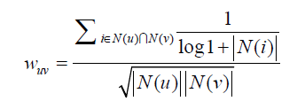
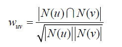
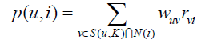
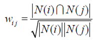
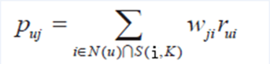

# 协同过滤（CF）

Collaborative Filtering

## 基于用户的协同过滤算法（UserCF）

**找到相似用户集合，适用于user少（新闻）、item实时性高、user实时性低**

a) 找到和目标用户兴趣相似的用户集合

b) 找到这个集合中的用户喜欢的，且目标用户没有听说过的物品推荐给目标用户。（N（i）是对物品i的喜欢人数）

1. 通过jaccard或者余弦相似度，通过两人的喜爱物品，求得两个用户的兴趣相似度（这里可以事先统计每两个用户的公共物品数量）jaccard公式：分子中的倒数惩罚了用户u和用户v列表中热门物品对他们相似度的影响。N(i)是对物品i有过行为的用户集合，越热门，N(i)越大.
2. 给用户推荐和他兴趣最相似的K个用户喜欢的物品。用户u对物品i的感兴趣程度如下公式，$S(u, K)$包含和用户u兴趣最接近的K个用户，N(i)是对物品i有过行为的用户集合，Wuv是用户u和用户v的兴趣相似度，Rvi代表用户v对物品i的兴趣，因为使用的是单一行为的隐反馈数据，所以所有的Rvi=1。

## 基于物品的协同过滤算法(ItemCF)

**找到相似物品集合，适用于item少、item实时性低、侧重个人user（新用户启动较快）**

用户购买序列、物品共现矩阵(i\*i)、用户评分向量 $\cdot$ 共现矩阵=推荐($c*i \cdot i*i$) 

给用户推荐那些和他们之前喜欢的物品相似的物品。实时性低，离线（商品）

1. 计算物品相似度，i,j 两件物品，$|N(i)|$是喜欢物品 i 的用户数。(用户活跃度大的用户可能喜欢列表中有很多商品，会影响ItemCf算法计算结果准确性，后面优化算法会增加一个用户活跃度分子)
2. 根据物品的相似度和用户的历史行为给用户生成推荐列表。

其中，Puj表示用户u对物品j的兴趣，N(u)表示用户喜欢的物品集合（i是该用户喜欢的某一个物品），S(i,k)表示和物品i最相似的K个物品集合（j是这个集合中的某一个物品），Wji表示物品j和物品i的相似度，Rui表示用户u对物品i的兴趣（这里简化Rui都等于1）。

