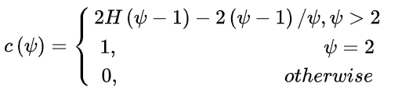
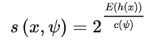

利用一种名为孤立树$iTree$的二叉搜索树结构来孤立样本。再用森林结构增大鲁棒性。

由于异常值的数量较少且与大部分样本的疏离性，因此，异常值会被更早的孤立出来，也即异常值会距离$iTree$的根节点更近，而正常值则会距离根节点有更远的距离。

## 算法

1. 随机采样$n'$条样本，作为新一棵树根节点的数据集
2. 从d个特征中随机选取一个特征q，从该节点的数据中随机产生切割点p，生成左右子节点。
3. 叶子节点递归第二步，直到该叶子节点只有一个样本点或者树高度到上限。
4. 循环1-3步，直到生成t个树。
5. 计算异常值分数，相当于每一棵树上求归一化的平均高度

sklearn的实现里，不是深度，而是测试集的这个叶子节点上，有多少个log(训练集样本数)，对所有树求和，再归一化（除以 树的数量*log(总样本数）)