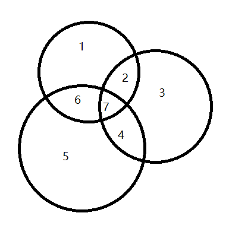

## shap

https://zhuanlan.zhihu.com/p/85791430

https://www.jianshu.com/p/324a7c982034

1. 树上最多node个特征
2. 分配样本的权重，代表该条样本还剩数量。初始为1，被某个结点分裂后，两种情况：使用和不使用(1/0)，更新子节点的权重。

变量间其实是有相互关系的，比如：A,B,C=》y ，如下图，是存在变量间关系的，有些提升是共有的，有些提升是独立的，如果单纯f(ABC)-f(AB)，那么计算出的只是它独立部分的权重



## eli5


主要用于nlp、crf、keras的图片也可以

```python
eli5.show_weights(clf,
                  feature_names=vec.get_feature_names(),
                  target_names=twenty_test.target_names)

eli5.show_prediction(clf, twenty_test.data[0], 
                  feature_names=vec.get_feature_names(),
                  target_names=twenty_test.target_names)

//lgb
no_missing = lambda feature_name, feature_value: not np.isnan(feature_value)
show_prediction(clf, valid_xs[1], vec=vec, show_feature_values=True, feature_filter=no_missing)
```


## 功能

- 调试：通过查看结果中各个不同特征给与的权重，看到测试集中不同数据的不同关注点，从而**改进模型**或**发现数据中的异常**
- 删除：删除特别好的特征，看看模型剩下会在哪些地方进行工作，从而获得启发
- 黑盒的`TextExplainer`
- 


