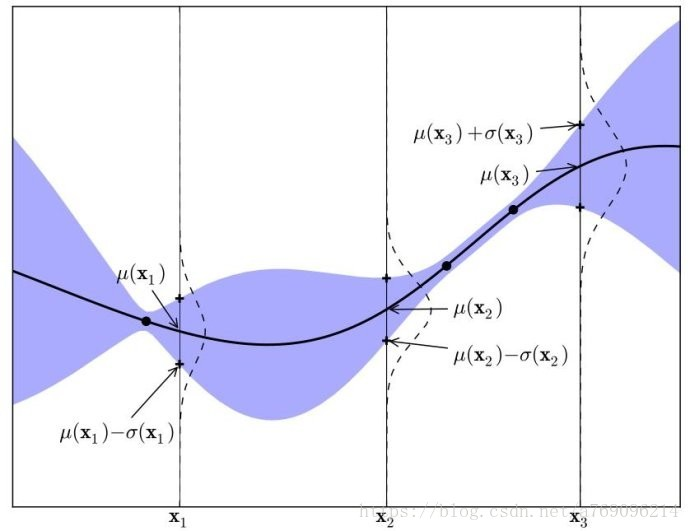
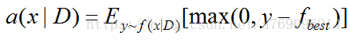
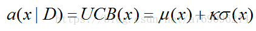
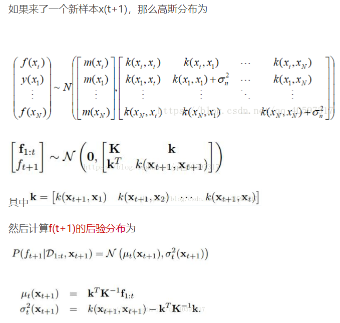

## 为什么用高斯过程？

1. 不需要参数
2. 它的边缘概率分布与高斯过程非常类似
3. 协方差与核函数定义类似，因此其实用上了kernel化K(x,x')

## 算法

```python
D = init_sample_results(sample_num) # 获取初始点及其结果
for i in range(T):
    p(y|x,D) = Model(D) # 每一次根据现有采样结果，拟合模型，得到预测分布
    x = argmax(P(y|x,D)) # 挑选预测分布得分最高的点，这里可以根据概率去跳出现有采样的局部性
    y = f(x) # 得到这个点的精确解
    D = D.append((x,y)) # 把这个点加入到集合中
```

其中由分布去预测下一个可能有更好结果的点的时候，根据高斯过程的概率密度函数，比较启发式。

高斯过程有每个位置的概率密度函数，即知道每个位置大致的结果和抖动幅度。因此可以给这个概率分布一个比例，比如2均值+1方差，这样控制探索未知区域的结果。

## 高斯过程


**一元高斯分布**的概率密度：


在概率论中，讲过样本空间，随机变量相当于是在样本空间中的一次采样，采样的结果是一个事件，在每次采样的时候都满足一定的分布。随机过程和随机变量的区别在于，样本空间里装的不是事件，装的是过程（一串事件）。每次的采样的结果是一个过程，比如一个序列，一个时间的函数等等。



## 使用的acquisition 函数

1. EI （Expected Improvement）



2. UCB(upper confidence bound)



## 高斯过程回归


### 为什么能套核函数  

（1）协方差矩阵必须是半正定阵

  （2）kernel fountion都是半正定阵。这就意味着我们在学习SVM的时候所学过的核函数形式都可以用

为什么半正定：假设协方差矩阵为C，因为xTCx的期望为方差≥0，因此半正定。

半正定代表什么：正定、半正定矩阵 M 就是代表：一个向量 (a) 经过它 (M) 变化后的向量(b), 与其本身 (a) 的夹角小于等于90度。(a b 间的夹角<= 90度)

### 推导

根据数据集$D(X,Y)$和贝叶斯公式，




然后对这个最终式子梯度下降

