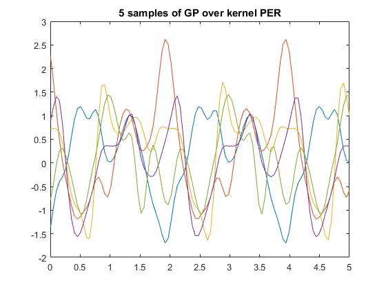
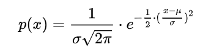

## 算法

```python
D = init_sample_results(sample_num) # 获取初始点及其结果
for i in range(T):
    p(y|x,D) = Model(D) # 每一次根据现有采样结果，拟合模型，得到预测分布
    x = argmax(P(y|x,D)) # 挑选预测分布得分最高的点，这里可以根据概率去跳出现有采样的局部性
    y = f(x) # 得到这个点的精确解
    D = D.append((x,y)) # 把这个点加入到集合中
```

其中由分布去预测下一个可能有更好结果的点的时候，根据高斯过程的概率密度函数，比较启发式。

高斯过程有每个位置的概率密度函数，即知道每个位置大致的结果和抖动幅度。因此可以给这个概率分布一个比例，比如2均值+1方差，这样控制探索未知区域的结果。

## 高斯过程



**一元高斯分布**的概率密度：




