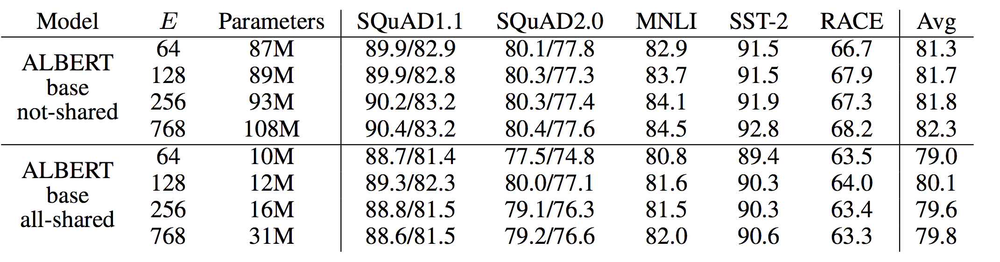

主要减内存，时间没减

## 减少embedding的参数量

先变小再变大embedding，O(V×H)降低到了O(V×E+E×H)

## attention跨层参数共享

因为各层的attention可视化后非常类似

## 去除主题识别的影响

bert希望判断前后两句是否是连续句子，但是其实判断的是主题。负样本选取的是其他文档的语句。

现在albert负样本使用正样本的顺序颠倒。

## 去除dropout

大规模数据没有过拟合，因此移除后反倒效果好

