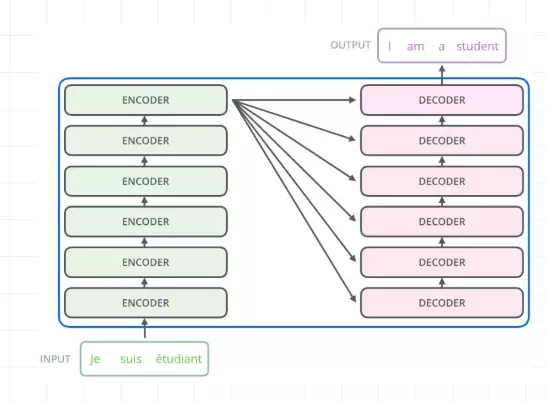
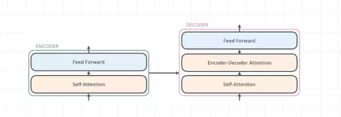
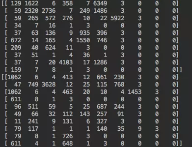
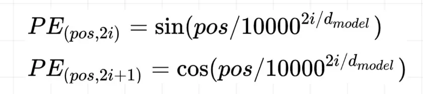
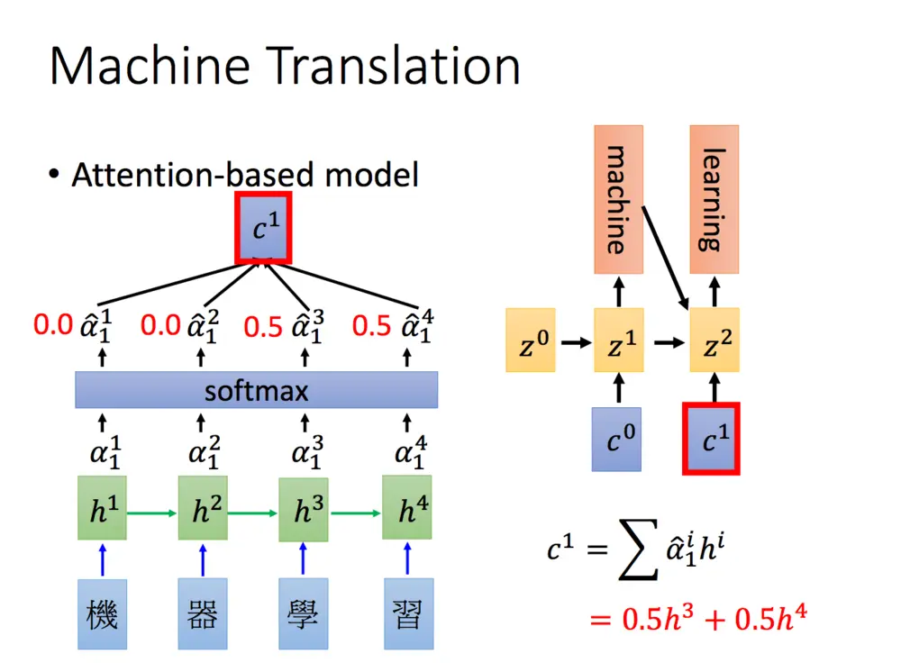
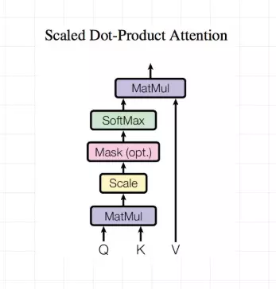

# Transformer

## 参考

完全参考 ： <https://www.jianshu.com/p/b1030350aadb>

部分参考：<https://www.jianshu.com/p/3b4889ae53b8>

## 理论（未完善）

内部：

数据，输入的单词id加上0填充：

**position Embedding**

pos: 

## Multi-Head Attention

普通attention如上图，Q：query，代表要加权的矩阵。K_i：key，代表Q对应于每一个key。将它们点乘：$Q^TK_i$ ，得到两者相似度。相似度softmax一下，即为每一个的权重了。

对于普通attention，Q和K是同一个。对于encoder-decoder，Q为decoder的输入，K为encoder的输入，因为要计算Q和K里面每一个的对应权重。

