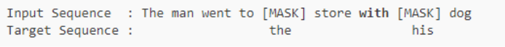
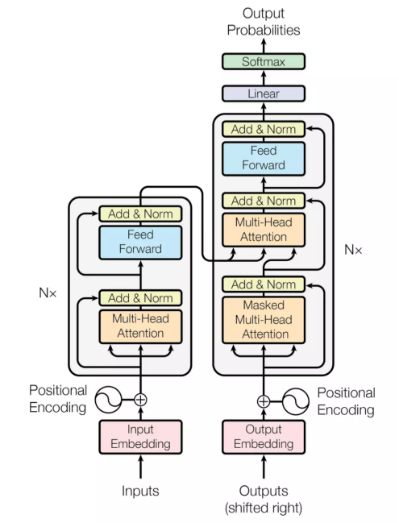
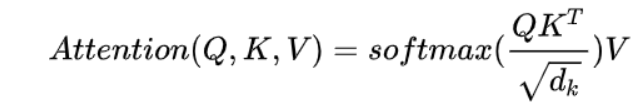
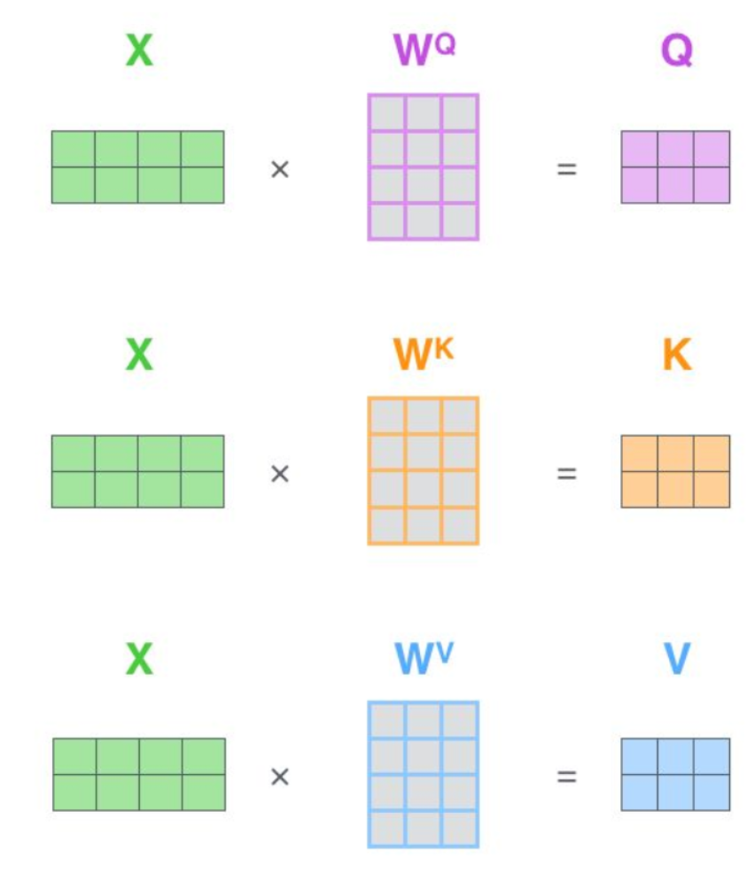

# BERT

只用了transformer的encoder模块

## 参考

- [word2vec, ELMo, BERT的比较](https://www.cnblogs.com/rucwxb/p/10277217.html)
- 

## 理论

三大亮点：Masked LM、transformer、sentence-level

### Masked Language Model

mask语料中15%的token，因此输入一个句子，预测每句句子中大概15%的词。mask方式：80%【mask】，10%随机采样的词来替代，10%不替换。因为【mask】标记在后续任务中不存在，所以这样可以让模型既学会完形填空，也学会找空。

### **Transformer** 

图中是transformer模型一个结构，分成左边Nx框框的encoder和右边Nx框框的decoder，相较于RNN+attention常见的encoder-decoder之间的attention（上边的一个橙色框），还多出encoder和decoder内部的self-attention（下边的两个橙色框）。每个attention都有multi-head特征。最后，通过position encoding加入没考虑过的位置信息。

**multi-head attention:**

**self-attention：**

**position encoding:**

**句子级负采样**

**句子级表示**

**segment embedding**

