# Transformer

decoder输入：前一时刻Decoder输入+前一时刻Decoder的预测结果 + Positional Encoding

shift right：控制输入句子长度比如64，那么长度大于64的，训练时可以切段，预测时则需要整体右移，每次用63个预测第64个

## 参考

完全参考 ： <https://www.jianshu.com/p/b1030350aadb>

部分参考：<https://www.jianshu.com/p/3b4889ae53b8>

## 理论

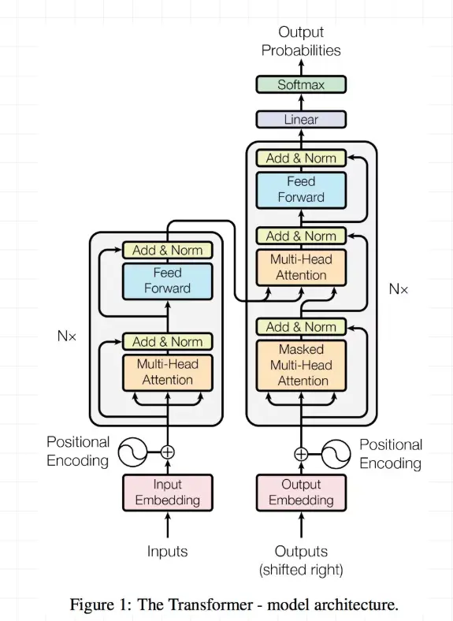

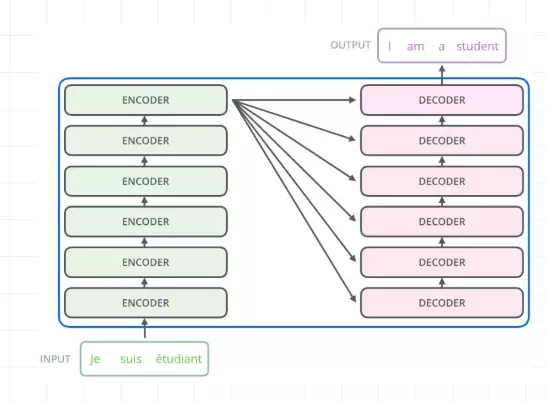

内部：

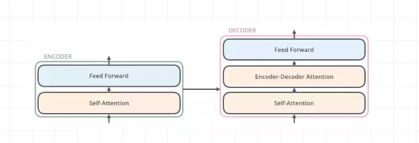

数据，输入的单词id加上0填充：

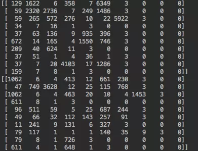

**position Embedding**

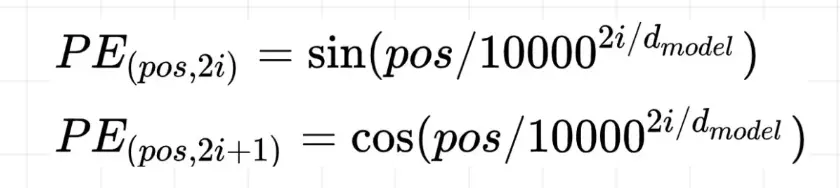

pos: 

## attention

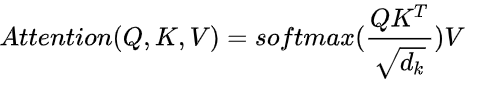

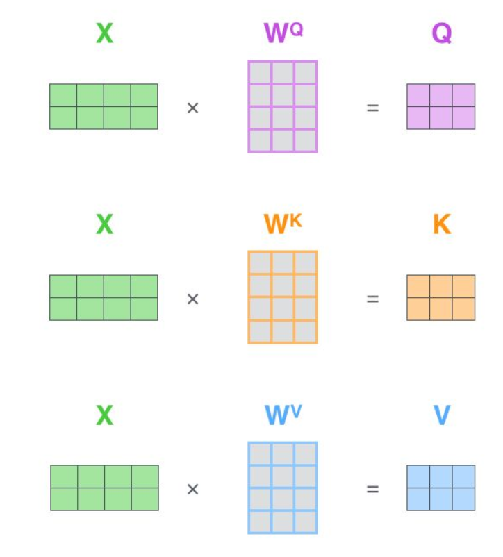

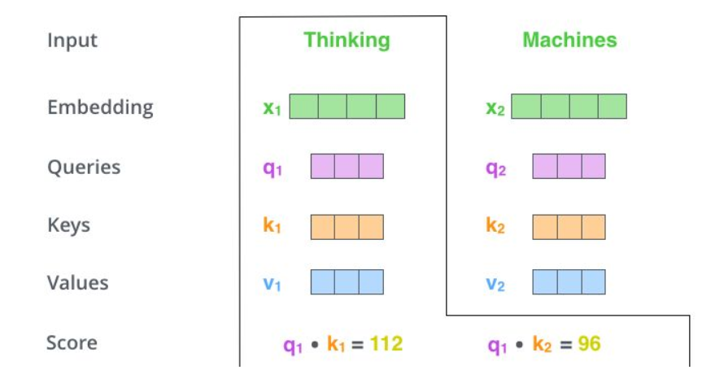

## Multi-Head Attention

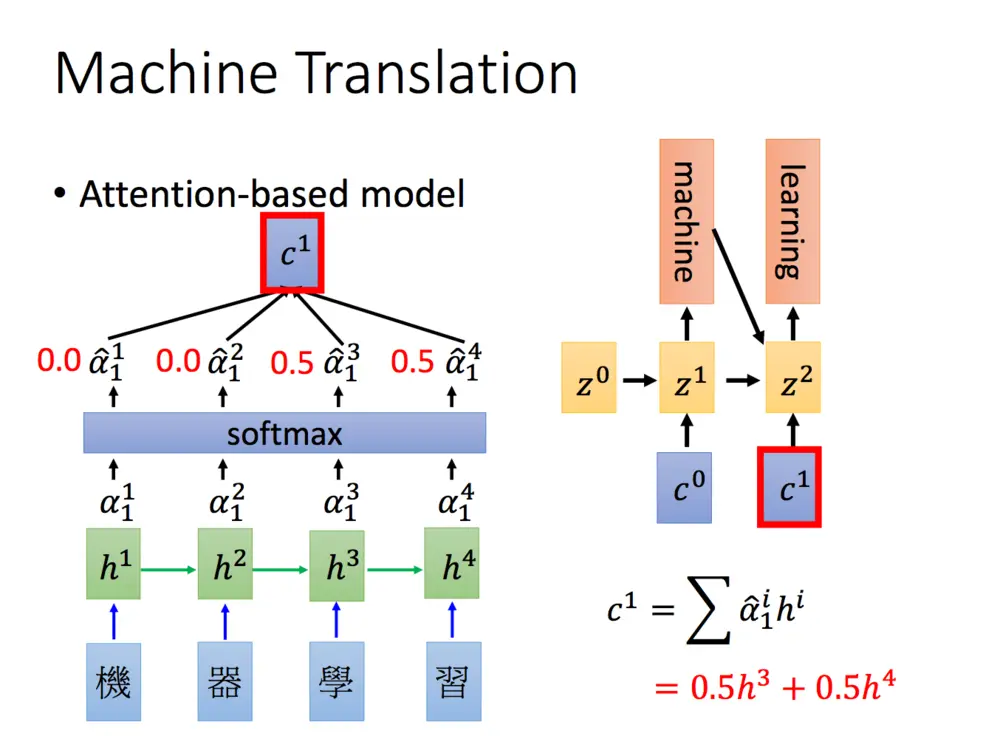

普通attention如上图，Q：query，代表要加权的矩阵。K_i：key，代表Q对应于每一个key。将它们点乘：$Q^TK_i$ ，得到两者相似度。相似度softmax一下，即为每一个的权重了。

对于普通attention，Q和K是同一个。对于encoder-decoder，Q为decoder的输入，K为encoder的输入，因为要计算Q和K里面每一个的对应权重。

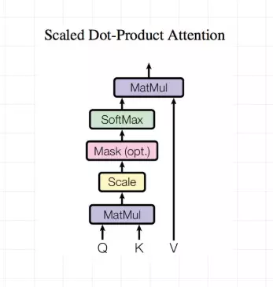

# Transformer-XL

循环机制（Recurrence Mechanism）和相对位置编码（Relative Positional Encoding）

## 循环机制

缓存过去段的数据。加速运行、提升记忆

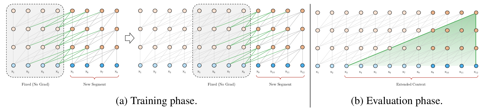

在训练阶段，处理后面的段时，每个隐藏层都会接收两个输入：

1. 该段的前面隐藏层的输出，与vanilla Transformer相同（上图的灰色线）。
2. 前面段的隐藏层的输出（上图的绿色线），可以使模型创建长期依赖关系。（no grad）

