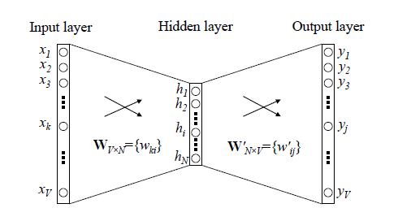

# word2vec

## 参考

- [cbow 与 skip-gram](https://www.cnblogs.com/bincoding/p/9065110.html)

## 理解

1 输入层：上下文单词的onehot.  {假设单词向量空间dim为V，上下文单词个数为C}
 2 所有onehot分别乘以共享的输入权重矩阵W. {V*N矩阵，N为自己设定的数，初始化权重矩阵W} 3 所得的向量 {因为是onehot所以为向量} 相加求平均作为隐层向量, size为1*N.
 4 乘以输出权重矩阵W' {N*V} 5 得到向量 {1*V} 激活函数处理得到V-dim概率分布  {PS: 因为是onehot嘛，其中的每一维斗代表着一个单词}
 6 概率最大的index所指示的单词为预测出的中间词（target word）与true label的onehot做比较，误差越小越好（根据误差更新权重矩阵）

**对于词向量而言：**

cbow: 输入该词上下各2个单词，输出它。

skip-gram： 输入该词，输出它对应的上下文词。

传统的词向量网络：

由于softmax太大，主要采用**Hierarchical Softmax**和**Negative Sampling**。

Hierarchical Softmax： 为了解决隐藏层到输出层计算量太大的问题，主要softmax。如下图，根节点就是中间hidden layer的词向量，叶子节点个数就是词汇表的大小。每个点都是二分类的sogmoid

Negative Sampling： 负采样，带权采样，高频词权重更大。原本对于所有词都有预测结果。现在只针对于负采样到的那些点更新权重（反向传播）

