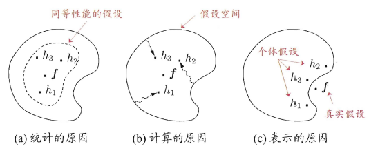

ensemble : 美 [ɑ:nˈsɑ:mbl]

## Boosting

boosting 主要解决偏差问题。

`AdaBoost` : 每一轮根据样本分布为每个训练样本重新赋予权重（只适用二分类问题）。

对于每一个弱分类器m：
$$
\begin{align}
& 1.在上一步的训练样本权重下学习得到本次分类结果G_m(x)
\\
& 2.计算分类误差率e_m = \sum_{i=1}^N w_{m,i} P(G_m(x_i) \ne y_i)
\\
& 3.更新G_m在总分类器上的权重a_m = \frac{1}{2}\log\frac{1-e_m}{e_m}
\\
& 4.更新样本权重w_{m+1,i}=\frac{w_{m,i}}{z_m} e^{-a_my_iG_m(x_i)}
\\
& ,其中z_m为了归一化概率为1，z_m=\sum_{i=1}^N w_{m,i} e^{-a_my_iG_m(x_i)}
\\
& 5.第i次循环后，强学习器F(x_i)=sign(\sum_{i=1}^N a_mG_m(x_i))
\\
& ,其中F_m(x)=F_{m-1}(x)+a_mG_m(x)
\end{align}
$$
公式推导：
$$
\begin{align}
指数损失：L=\frac{1}{n}\sum_{i=1}^n e^{-y_if(x_i)},y_i=
	\begin{cases} 
	1 \\ -1
	\end{cases}
\\

\end{align}
$$

$$
\begin{align}
因此，Loss_m= & \frac{1}{N} \sum_{i=1}^N e^{-y_iF_m(x_i)}
\\
代入(7)式,= & \frac{1}{N} \sum_{i=1}^N e^{-y_i(f_{m-1}(x_i)+a_mG_m(x_i))}
\\
= & \frac{1}{N} \sum_{i=1}^N \widetilde{w_{m,i}} e^{-y_ia_mG_m(x_i)}
\\
= & \frac{1}{N} \sum_{y_i=G_m(x_i)}\widetilde{w_{m,i}}e^{a_m} + \sum_{y_i \neq G_m(x_i)}\widetilde{w_{m,i}}e^{a_m}
\\
代入(2)式中e_m， = & (1-e_m)e^{-a_m}+e_me^{a_m}
\\
所以\frac{\partial Loss}{\partial a_m} = & \frac{1}{2} log\frac{1-e_m}{e_m}
\\

其中\widetilde{w_{m,i}} & = e^{y_iF_{m-1}(x_i)}为常数项，可以任意提出
\\
& =e^{-y_i(F_{m-2}(x_i)+a_{m-1}G_{m-1}(x_i))}
\\
& = \widetilde{w_{m-1,i}} e^{-y_ia_{m-1}G_{m-1}(x_i)}
\end{align}
$$

所以公式推导部分的(14)式就是(3)式中的更新该弱分类器在总分类器上的权重，(17)是就是更新样本权重。

## Bagging

Bagging 主要解决方差问题。

有放回采样，m个样本的训练集有放回采样m个，约有63.2%的初始训练集样本出现在采样集中（剩下36.8%的样本可以用作验证集、辅助剪枝、early-stopping等），从而确保每次的训练样本有所不同，使得一定程度上尽量“独立”。

## 随机森林

`随机森林`：在bagging基础上再引入随机属性选择，在d个可选属性中选择子集k，在k中选择最优属性进行划分，推荐值$k=log_2d$。

## 为什么要ensemble？

- 从统计上来说，假设空间很大，可能多个假设在训练集上达到同等性能，但可能有偏离，泛化性能不佳。

- 从计算上来说，会陷入局部最小，降低这种风险。

- 从表示上来说，有时学习任务的真是假设可能不在算法考虑的假设空间中，那么用单学习器肯定无效，而多个学习器会导致假设空间有所扩大，可能学得更好的近似。

  

## 结合策略

- 平均法
  - 普通平均法
  - 加权平均法
- 投票法
  - 相对较多投票法
  - 超过半数投票法
  - 加权投票法
- stacking
- 贝叶斯模型平均（BMA）：要求数据噪声小，因此鲁棒性差，对模型近似误差非常敏感

## 多样性度量

|            | $h_i$ = +1 | $h_i$ = -1 |
| :--------: | :--------: | :--------: |
| $h_j$ = +1 |     a      |     c      |
| $h_j$ = -1 |     b      |     d      |

- 不合度量：$dis_{ij} = \frac{b+c}{m}$ ，值域为[0,1]，值越大则多样性越大
- 相关系数：$\rho = \frac{ad-bc}{\sqrt{(a+b)(a+c)(c+d)(b+d)}}$ 值域为[-1,1]，无关则为0，绝对值越大越相关
- Q-统计量：$Q_{ij} = \frac{ad-bc}{ad+bc},Q_{ij}与相关系数\rho 的符号相同，且|Q_{ij}| \leq |\rho_{ij}|$
- k-统计量：$k=\frac{p_1-p_2}{1-p_2}，其中p_1=\frac{1+d}{m},p_2=\frac{(a+b)(a+c)+(c+d)(b+d)}{m^2}$，若完全一致则k=1，偶然达成一致则k=0，k通常非负，仅在$h_i$和$h_j$达成一致的概率比偶然还小时取负值

## 多样性增强

- 数据样本扰动：样本采样
- 输入属性扰动：属性采样
- 输出表示扰动：随机对少量输出类别进行反转 / 问题拆分多个子问题
- 算法参数扰动

